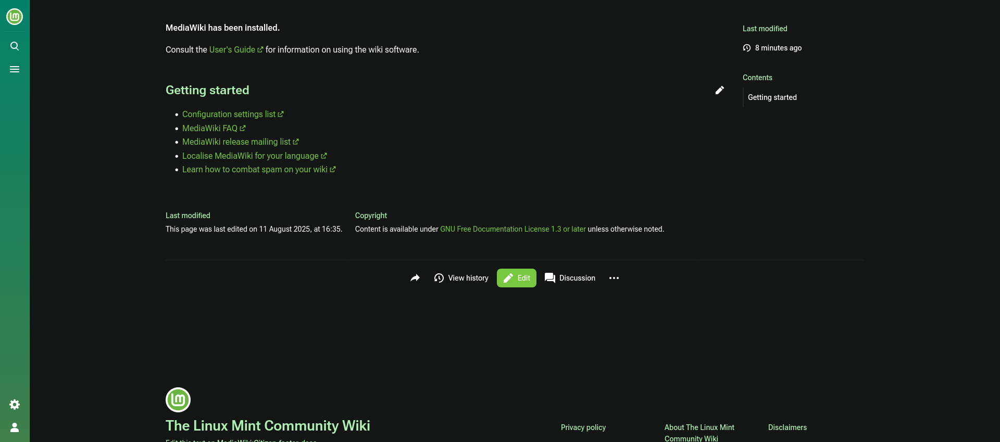

# The Linux Mint Community Wiki

## Introduction



Welcome to The Linux Mint Community Wiki repository. Here you can find the infrastructure used for hosting the wiki. You can find the wiki online at [Mirahaze Instance](https://mintguide.miraheze.org/wiki/Main_Page).

Instructions on how to set it up are included bellow and further documentation on how the whole infrastructure setup can be found in [docs currently are not implemented]().

> NOTE: Warning this repo is still work in progress and subject to be heavily modified for now.

## Instructions

### Installation

Follow these instructions to set up the wiki locally.

1. (You can skip this step if you have `Docker Desktop` or `Docker Engine`) Install [Docker Engine](https://docs.docker.com/engine/install/) from Docker's website.
2. Clone the repository in whichever directory you want.

```sh
git clone https://github.com/path/to/repo.git
```

4. Create the necessary environmental variables, an `.env.template` and `.env.example` are both provided.
5. Use the `./scripts.generate-keys.sh` file to generate the necessary keys.
6. Run Docker compose.

```sh
docker compose up -d
```

### Commands

To stop the containers just run the command bellow, after you have stopped the container and started it again this will import all the `.wikitext` files into the wiki again.

```sh
docker compose down
```

If you wish to stop the containers and also delete all the stored data such as the database and etc. run:

```sh
docker compose down -v
```

If you have modified the `LocalSettings.php.template` script run:

```sh
docker exec -it wiki /update-config.sh
```

To enter inside the MediaWiki instance you can create a bash instance inside the container:

```sh
docker exec -it wiki bash
```

## Contributions

Big shoutout to the [Linux Mint Community](https://discord.gg/mint) Discord server for helping out in the project and collaborating to make this project real.
